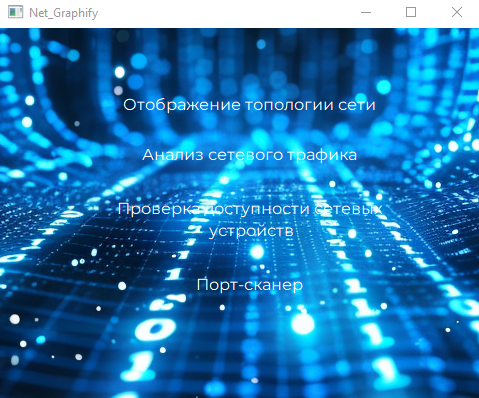
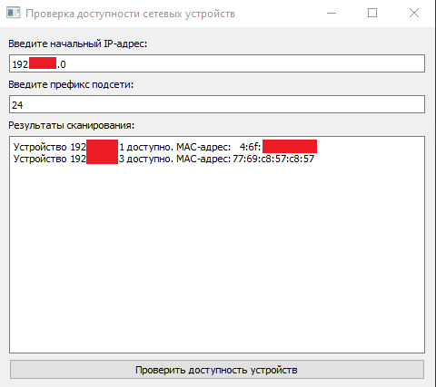
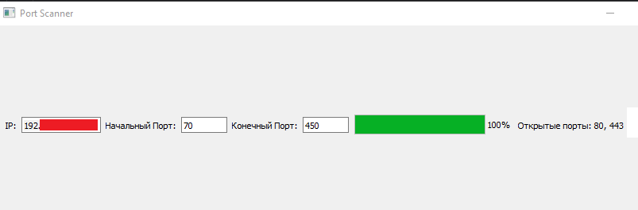

# net_graphify
Данный проект представляет собой приложение, разработанное на основе библиотеки PyQt5, которое предоставляет несколько функциональных возможностей для работы с сетевыми устройствами.

Функционал приложения включает:

1. Отображение топологии сети: этот инструмент предназначен для отображения информации о сетевых интерфейсах и их состоянии. Он позволяет пользователям быстро получить представление о сетевой топологии, включая типы интерфейсов, IP-адреса, MAC-адреса и состояние каждого интерфейса.

2. Анализ сетевого трафика: встроенный инструмент для мониторинга сетевого трафика.

3. Проверка доступности сетевых устройств: позволяет пользователю ввести начальный IP-адрес и префикс подсети, после чего производит сканирование сети и выводит результаты доступных устройств.

4. Порт-сканер: приложение проводит сканирование портов на сетевых устройствах и позволяет определить состояние портов (открытые, закрытые).

Проект предоставляет удобный и интуитивно понятный интерфейс пользователя, который позволяет легко использовать каждый из функционалов приложения.



### Чтобы установить проект, следуйте инструкциям ниже:

1. Установите PyQt5:

   ```
   pip install pyqt5
   ```

2. Склонируйте репозиторий:

   ```
   git clone https://github.com/your_username/net_graphify.git
   ```

3. Перейдите в каталог проекта:

   ```
   cd net_graphify
   ```
   
4.  Установите зависимости, перечисленные в файле requirements.txt:

   ```
   pip install -r requirements.txt
   ```


5. Запустите приложение:

   ```
   python main.py
   ```

   После запуска приложения вы увидите главное окно Net_Graphify, в котором доступны четыре кнопки:

   - Отображение топологии сети: при нажатии кнопки открывается окно для отображения информации о сетевой топологии.
   - Анализ сетевого трафика: при нажатии кнопки открывается окно для анализа сетевого трафика.
   - Проверка доступности сетевых устройств: при нажатии кнопки открывается окно для проверки доступности сетевых устройств.
   - 
   - Порт-сканер: при нажатии кнопки открывается окно для сканирования портов сетевых устройств.
   - 